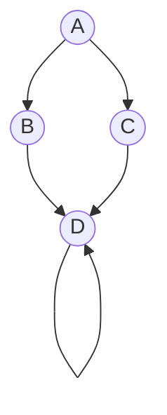
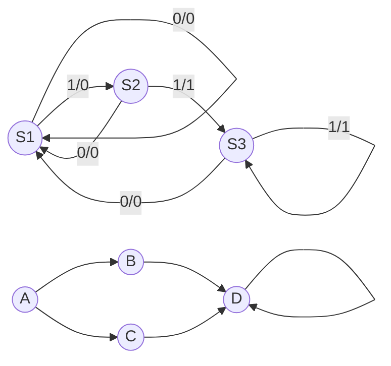

```mermaid
graph TD;
  A((A))-->B((B));
  A((A))-->C((C));
  B((B))-->D((D));
  C((C))-->D((D));
  D((D))-->D((D));
```

```mermaid
graph LR;
  S1((S1))-->|0/0|S1((S1));
  S1((S1))-->|1/0|S2((S2));
  S2((S2))-->|0/0|S1((S1));
  S2((S2))-->|1/1|S3((S3));
  S3((S3))-->|1/1|S3((S3));
  S3((S3))-->|0/0|S1((S1));
  

  A((A))-->B((B));
  A((A))-->C((C));
  B((B))-->D((D));
  C((C))-->D((D));
  D((D))-->D((D));
```
