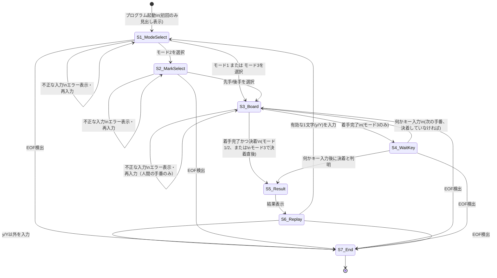

# 三目並べ（Tic-Tac-Toe）画面遷移仕様書

`tictactoe.c` の実装に基づき、実際にユーザーへ表示される画面（コンソール出力）の
一覧と、画面間の遷移条件をまとめる。

---

## 1. 画面一覧

| 画面ID | 画面名 | 表示するタイミング |
|---|---|---|
| S1 | モード選択画面 | ゲーム開始時、および1ゲーム終了後に再戦を選んだ直後 |
| S2 | 先手・後手選択画面 | モード2（CPU対戦）を選んだ直後のみ |
| S3 | ゲーム画面（盤面） | 手番が進むたび（着手の都度、画面クリア後に再表示） |
| S4 | 観戦一時停止画面 | モード3（CPU同士対戦）で、CPUが着手した直後 |
| S5 | 結果画面 | 勝敗または引き分けが確定した直後 |
| S6 | リプレイ確認画面 | 結果画面の直後 |
| S7 | 終了画面 | リプレイしない選択、またはEOF検出時 |

---

## 2. 各画面の表示内容

### S1: モード選択画面

```
=== 三目並べを開始します ===
対戦モードを選んでください。
1: 2人対戦
2: コンピュータと対戦
3: コンピュータ同士の対戦（観戦モード）
選択(1-3):
```

- 「=== 三目並べを開始します ===」は**プログラム起動時の最初の1回だけ**表示される
  （`main()`の先頭）。2回目以降のモード選択画面（再戦時）ではこの見出しは出ない。
- 不正な1文字（`1`〜`3`以外）が入力された場合は、この画面内でエラーメッセージ
  「1〜3のいずれかを入力してください。」を表示し、同じ画面のまま再入力を待つ
  （画面遷移はしない）。

### S2: 先手・後手選択画面（モード2のみ）

```
先手(X)・後手(O)どちらで対戦しますか？
1: 先手 (X)
2: 後手 (O)
選択(1-2):
```

- モード1・モード3を選んだ場合はこの画面を経由せず、直接S3へ進む。
- 不正な1文字（`1`・`2`以外）の場合は、エラーメッセージ「1か2を入力してください。」
  を表示し、この画面のまま再入力を待つ。

### S3: ゲーム画面（盤面）

```
 1 | 2 | 3
-----------
 4 | 5 | 6
-----------
 7 | 8 | 9

プレイヤー X の番です。マス番号(1-9)を入力してください:
```

- **表示直前に必ず画面クリア**（ANSIエスケープシーケンス）が行われるため、
  常に最新の盤面だけが画面いっぱいに表示される（過去の盤面は残らない）。
- 人間の手番の場合：盤面の下に「プレイヤー〇の番です。マス番号(1-9)を
  入力してください:」という入力プロンプトが表示される。
  - 不正な入力（範囲外／既に埋まっているマス）の場合は、エラーメッセージを
    表示した上でこの画面のまま再入力を待つ（盤面の再クリアはしない）。
- CPUの手番の場合：入力プロンプトの代わりに、着手後の盤面の下に
  「CPU（O）はマス5を選びました。」のようなメッセージが表示される
  （画面クリアで消えないよう、盤面表示の**後**に出すよう設計されている）。

### S4: 観戦一時停止画面（モード3のみ）

```
（S3の盤面とCPUの着手メッセージがそのまま表示された状態で）

(何かキーを押すと次へ進みます)
```

- モード3の場合のみ、S3の表示の直後に追加でこの一行が表示され、
  何らかの1文字が入力されるまで進行が止まる。
- Enterキーである必要はなく、有効な文字か無効な文字かの区別もない
  （どんな1バイトでも次に進む）。

### S5: 結果画面

```
（最終盤面が表示された状態のまま）

<勝敗・引き分けメッセージ>
```

勝敗・引き分けメッセージは、モードと状況に応じて次のいずれかになる。

| モード | 状況 | 表示メッセージ |
|---|---|---|
| 1 | 決着 | `プレイヤー X の勝ちです！`（`X`の部分は勝者の記号） |
| 2 | 人間の勝ち | `あなた（X）の勝ちです！` |
| 2 | CPUの勝ち | `コンピュータ（O）の勝ちです！` |
| 3 | 決着 | `CPU（X）の勝ちです！` |
| 共通 | 全マス消化後の引き分け | `引き分けです。` |
| 共通 | 早期確定の引き分け（空きマスあり） | `空きマスは残っていますが、これ以上誰も勝てないため引き分けです。` |

### S6: リプレイ確認画面

```
もう一度遊びますか？ (y/n):
```

- S5の直後、追加の画面クリアなしにそのまま続けて表示される。
- `y`または`Y`が入力された場合のみS1（モード選択画面）へ戻る。
- それ以外の文字（`n`、`N`、その他任意の文字）の場合はS7（終了画面）へ進む。
  厳密な"n"のバリデーションは行っておらず、"y"/"Y"以外はすべて「いいえ」として扱う。

### S7: 終了画面

```
ゲームを終了します。お疲れ様でした。
```

- この表示の後、プログラムは終了する（`main()`が`return 0`する）。
- 入力ストリームがEOFになった場合（`Ctrl+D`など）も、各入力待ち関数
  （`readRawByte`内）から直接この一文相当のメッセージ
  「入力が終了しました。ゲームを終了します。」を表示して`exit(0)`するため、
  実質的にどこからでもこの終了扱いに落ちる。

---

## 3. 画面遷移図



---

## 4. 遷移条件のまとめ表

| 現在の画面 | 入力・イベント | 遷移先 |
|---|---|---|
| S1 モード選択 | `1`〜`3`のいずれか | モード1・3ならS3、モード2ならS2 |
| S1 モード選択 | それ以外の文字 | S1のまま（再入力） |
| S2 先手後手選択 | `1`または`2` | S3 |
| S2 先手後手選択 | それ以外の文字 | S2のまま（再入力） |
| S3 ゲーム画面（人間の手番） | 有効なマス番号（空いている1-9） | 決着なら S5、決着せずモード3ならS4、それ以外はS3のまま次の手番へ |
| S3 ゲーム画面（人間の手番） | 無効な入力 | S3のまま（再入力） |
| S3 ゲーム画面（CPUの手番） | （入力不要・自動着手） | 決着ならS5、決着せずモード3ならS4、それ以外はS3のまま次の手番へ |
| S4 観戦一時停止 | 何か1文字 | 決着していればS5、していなければS3 |
| S5 結果画面 | （入力不要・自動でS6へ） | S6 |
| S6 リプレイ確認 | `y`または`Y` | S1 |
| S6 リプレイ確認 | それ以外の文字 | S7 |
| 任意の入力待ち画面 | EOF（`Ctrl+D`等） | S7 |

---

## 5. 補足

- 画面クリアは**S3（ゲーム画面）の表示直前にのみ**発生する。S1・S2・S5・S6・S7では
  画面クリアを行わないため、これらの画面の内容は直前の画面（多くはS3の最終盤面）に
  続けて画面下部に追記される形で表示される。
- S4（観戦一時停止）はS3の表示に対する「追加の1行」であり、独立した別画面という
  よりは、S3画面の続きとして捉えるとよい。
