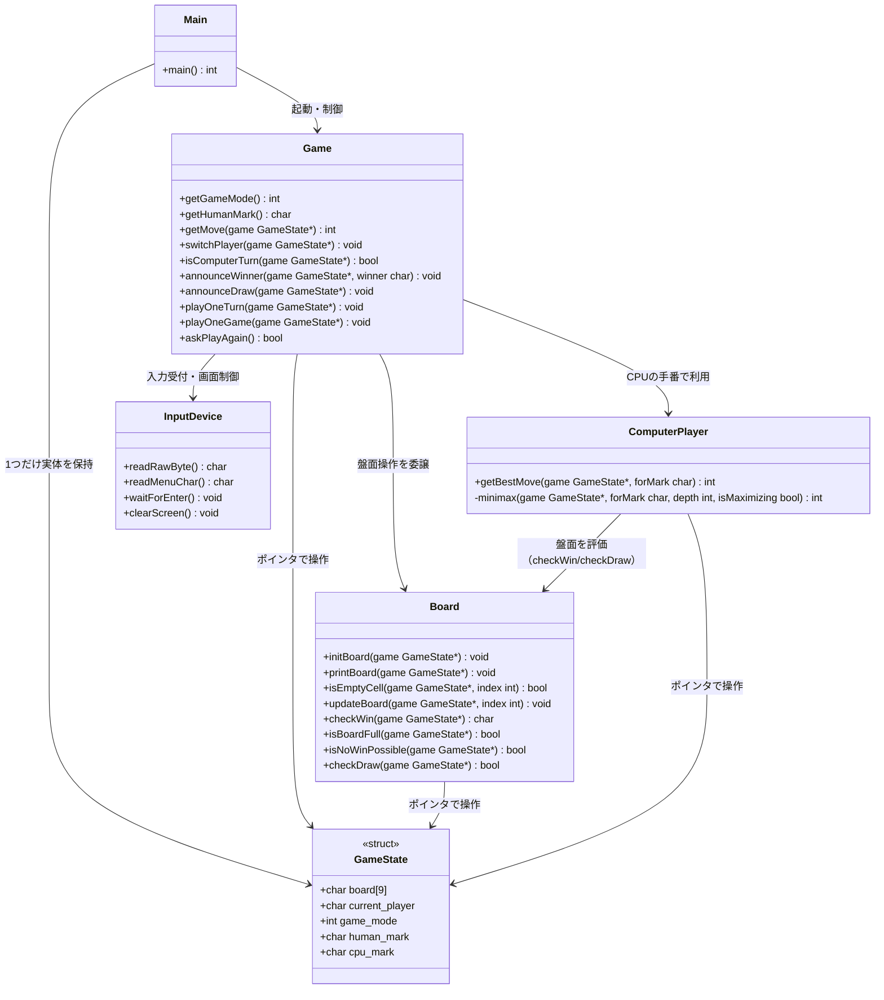
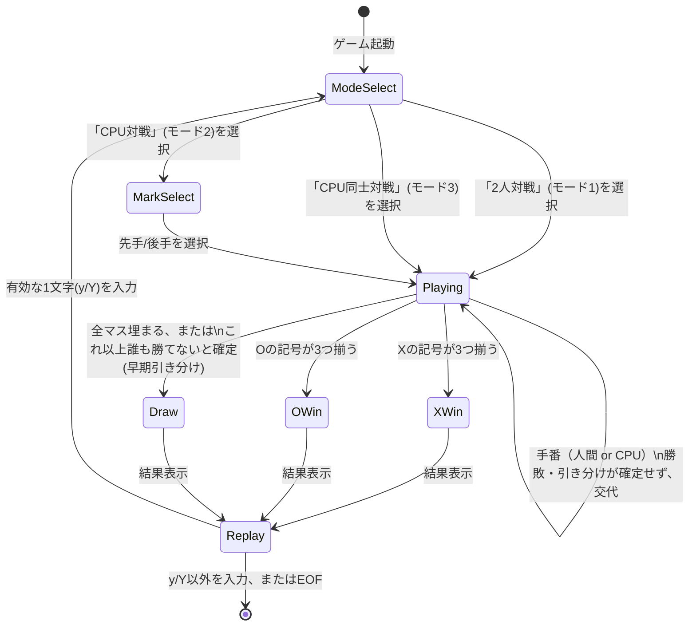
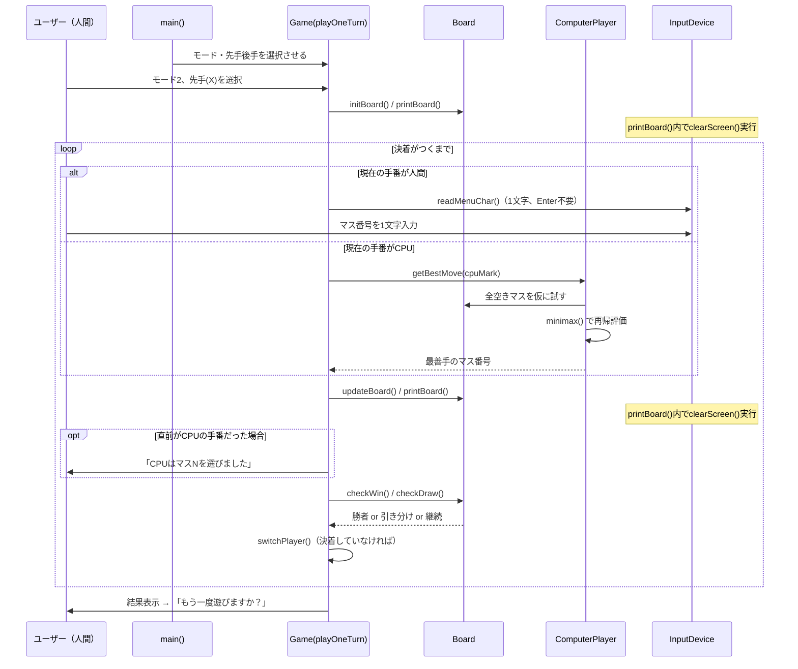
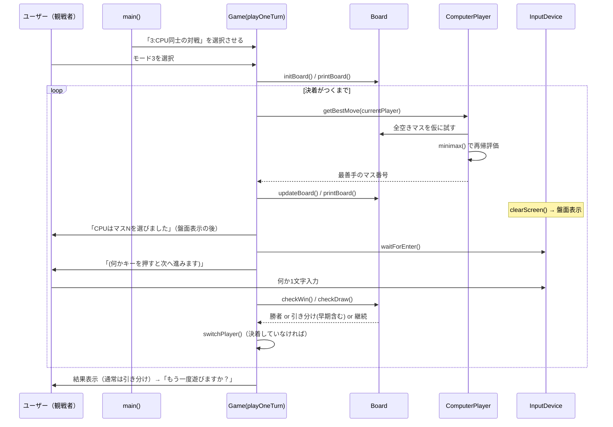

# 三目並べ（Tic-Tac-Toe）UML仕様書

本書は `tictactoe_spec.md`（機能仕様書）および `tictactoe.c`（実装）に対応するUML図をまとめたものである。
C言語による手続き型実装のため、状態を保持する `GameState` 構造体と、それを操作する関数群を、
論理的なクラスとして概念モデル化している。

Mermaid記法で記述しているため、GitHubやVSCode（Mermaid拡張）などで図として表示できる。

---

<a id="uml-sec-1"></a>
## 1. クラス図（Class Diagram）

`GameState`（旧: 複数のグローバル変数）にゲーム全体の状態を集約し、
`Board` 操作関数・`Game` 進行管理関数・`ComputerPlayer`（CPU思考）・`InputDevice`（1文字入力）に
責務を分割している。実装上はいずれも `GameState` へのポインタを引数に取る関数群だが、
UML上は関連するクラスとして表現する。



**対応関係（実装関数 ⇔ クラスメソッド）**

| クラス | メソッド | 対応するC関数 |
|---|---|---|
| Board | initBoard() | `initBoard()` |
| Board | printBoard() | `printBoard()`（内部で`clearScreen()`を呼ぶ） |
| Board | isEmptyCell() | `isEmptyCell()` |
| Board | updateBoard() | `updateBoard()` |
| Board | checkWin() | `checkWin()` |
| Board | isBoardFull() | `isBoardFull()` |
| Board | isNoWinPossible() | `isNoWinPossible()` |
| Board | checkDraw() | `checkDraw()` |
| Game | getGameMode() | `getGameMode()` |
| Game | getHumanMark() | `getHumanMark()` |
| Game | getMove() | `getMove()` |
| Game | switchPlayer() | `switchPlayer()` |
| Game | isComputerTurn() | `isComputerTurn()` |
| Game | announceWinner() | `announceWinner()` |
| Game | announceDraw() | `announceDraw()` |
| Game | playOneTurn() | `playOneTurn()` |
| Game | playOneGame() | `playOneGame()` |
| Game | askPlayAgain() | `askPlayAgain()` |
| ComputerPlayer | getBestMove() | `getBestMove()` |
| ComputerPlayer | minimax() | `minimax()` |
| InputDevice | readRawByte() | `readRawByte()` |
| InputDevice | readMenuChar() | `readMenuChar()` |
| InputDevice | waitForEnter() | `waitForEnter()` |
| InputDevice | clearScreen() | `clearScreen()` |
| Main | main() | `main()` |

---

<a id="uml-sec-2"></a>
## 2. 状態遷移図（State Diagram）

ゲーム全体が取りうる状態と遷移条件（モード選択を含む）。



---

<a id="uml-sec-3"></a>
## 3. アクティビティ図（Activity Diagram）

1手番あたりの処理フロー。画面クリアと、CPU着手メッセージの表示順序
（機能仕様書 [4.2節](tictactoe_spec.md#sec-4-2) の制約）を反映している。

```mermaid
flowchart TD
    Start([開始]) --> SelMode[対戦モードを選択\n1:2人 2:CPU対戦 3:CPU同士]
    SelMode --> IsMode2{モード2\nCPU対戦?}
    IsMode2 -- Yes --> SelMark[先手/後手を選択]
    IsMode2 -- No --> Init
    SelMark --> Init[盤面初期化]
    Init --> Print1[画面クリア＋盤面表示]
    Print1 --> DetermineTurn{手番の主体は?}

    DetermineTurn -- モード3:常にCPU --> CpuThink3[getBestMove\n現在の手番側の記号]
    DetermineTurn -- モード2:CPU側の手番 --> CpuThink2[getBestMove\ncpuMark]
    DetermineTurn -- モード1 or モード2:人間側 --> Input[1文字入力\nEnter不要]

    CpuThink3 --> Update
    CpuThink2 --> Update

    Input --> ValidNum{1〜9の範囲内?}
    ValidNum -- No --> ErrMsg1[エラー表示]
    ErrMsg1 --> Input
    ValidNum -- Yes --> ValidEmpty{そのマスは\n空いている?}
    ValidEmpty -- No --> ErrMsg2[エラー表示]
    ErrMsg2 --> Input
    ValidEmpty -- Yes --> Update[盤面を更新]

    Update --> Print2[画面クリア＋盤面を再表示]
    Print2 --> WasCpu{直前の手番は\nCPUだった?}
    WasCpu -- Yes --> ShowCpuMove[「CPUはマスNを\n選びました」を表示]
    WasCpu -- No --> IsMode3
    ShowCpuMove --> IsMode3{モード3?}
    IsMode3 -- Yes --> Wait[何かキー入力を待つ]
    Wait --> CheckWin
    IsMode3 -- No --> CheckWin{勝者がいる?}

    CheckWin -- Yes --> ShowWin[勝者を表示]
    ShowWin --> AskReplay
    CheckWin -- No --> CheckDraw{引き分け?\n(全埋まり or 早期確定)}
    CheckDraw -- Yes --> ShowDraw[引き分けを表示\n(理由に応じ文言変更)]
    ShowDraw --> AskReplay
    CheckDraw -- No --> Switch[手番を交代]
    Switch --> DetermineTurn

    AskReplay{もう一度遊ぶ?\n1文字入力}
    AskReplay -- y/Y --> SelMode
    AskReplay -- それ以外/EOF --> End([終了])
```

---

<a id="uml-sec-4"></a>
## 4. シーケンス図（Sequence Diagram）

<a id="uml-sec-4-1"></a>
### 4.1 モード2（人間 対 CPU）

CPUの着手メッセージが、画面クリアを伴う `printBoard()` の**後**に表示される点に注意。



<a id="uml-sec-4-2"></a>
### 4.2 モード3（CPU 対 CPU、観戦モード）



---

<a id="uml-sec-5"></a>
## 5. 図と機能仕様書の対応

| UML図 | 対応する機能仕様書の章 |
|---|---|
| クラス図 | [6. 内部データ仕様](tictactoe_spec.md#sec-6) / [10. 使用関数（想定）](tictactoe_spec.md#sec-10) |
| 状態遷移図 | [3. 対戦モード仕様](tictactoe_spec.md#sec-3) / [7.1 引き分け判定の早期化](tictactoe_spec.md#sec-7-1) / [9. 処理フロー](tictactoe_spec.md#sec-9) |
| アクティビティ図 | [4. 画面表示仕様](tictactoe_spec.md#sec-4) / [5. 入力仕様](tictactoe_spec.md#sec-5) / [8. 画面クリア仕様](tictactoe_spec.md#sec-8) / [9. 処理フロー](tictactoe_spec.md#sec-9) |
| シーケンス図 | [9. 処理フロー](tictactoe_spec.md#sec-9) 全体（モード2・モード3、メッセージ表示順序を含む） |
